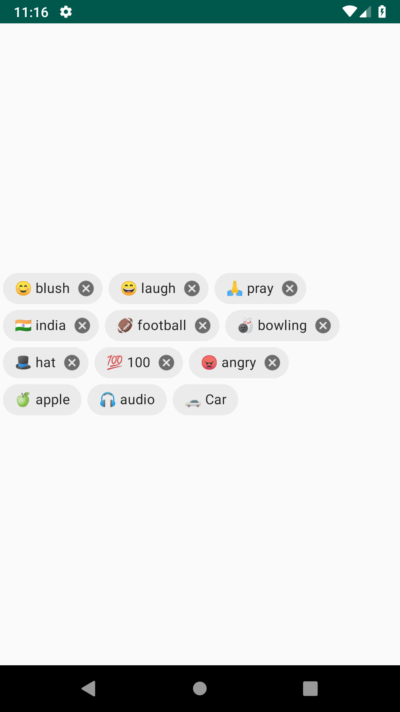

# EmojiTags

A simple Android library to display tags with auto suggested Emojis like:



## Installation

This library is distributed via jitpack. To add it to your android project

Step 1. Add the JitPack repository to your project level `build.gradle` file

```
allprojects {
  repositories {
    ...
    maven { url 'https://jitpack.io' }
  }
}
```
Step 2. Add the dependency

```
implementation 'com.github.amolgupta:EmojiTags:master'
```


## Usage

#### With a list of strings

```
val stringTagsView = EmojiTagsView(this)
stringTagsView.adapter = TagsViewStringAdapter(arrayListOf("blush", "laugh", "pray","India", "football", "bowling","red", "100", "angry"))

```

#### With a list of objects
The data class must extend `Emojiable` interface and provide lookup fields

```
val objectTagsView = EmojiTagsView(this)
objectTagsView.adapter = TagsViewDataAdapter(DummyTag.getDummyTags())
```   

#### Show dismiss button
```
stringTagsView.isCancelable = true
```     
#### Add listener on dismiss

```
(stringTagsView.adapter as TagsViewStringAdapter).listener = object : TagsViewStringAdapter.TagListener {
           override fun onTagDismiss(tag: String) {
               Toast.makeText(applicationContext,"Tag dismissed",Toast.LENGTH_SHORT).show()
           }
       }
```


## Pending work

- Support for collapsing
- Support emoji fallback
- Optimise search for performance
- Add test cases
- Properties via xml attributes
- Use Emoji as drawable instead of text

## Notes
The text to emoji mapping is taken from [gemoji](https://github.com/github/gemoji/blob/master/db/emoji.json)
